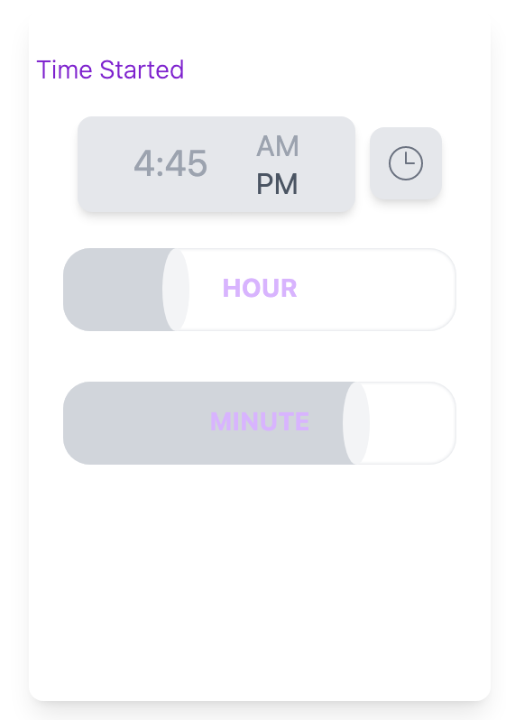

# React Component Library

Reusable React + Tailwind components with TypeScript support.

![react.js]![tailwindcss]![typescript]

## Components

### Time Selecter

-   Adjust hour and minute with slider component
-   Set meridiem
-   Set to current time

[react.js]: https://img.shields.io/badge/React-20232A?style=for-the-badge&logo=react&logoColor=61DAFB
[tailwindcss]: https://img.shields.io/badge/Tailwind_CSS-38B2AC?style=for-the-badge&logo=tailwind-css&logoColor=white
[typescript]: https://img.shields.io/badge/TypeScript-007ACC?style=for-the-badge&logo=typescript&logoColor=white
